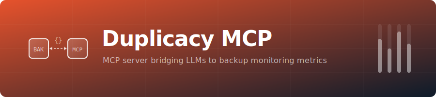

<p align="center">
  
</p>

<h1 align="center">Duplicacy-MCP</h1>

<p align="center">
  <a href="https://codecov.io/gh/GeiserX/duplicacy-mcp"></a>
  <a href="https://www.npmjs.com/package/duplicacy-mcp"></a>
  
  <a href="https://hub.docker.com/r/drumsergio/duplicacy-mcp"></a>
  <a href="https://github.com/GeiserX/duplicacy-mcp/stargazers"></a>
  <a href="https://github.com/GeiserX/duplicacy-mcp/blob/main/LICENSE"></a>
</p>
<p align="center">
  <a href="https://registry.modelcontextprotocol.io"></a>
  <a href="https://glama.ai/mcp/servers/GeiserX/duplicacy-mcp"></a>
  <a href="https://mcpservers.org/servers/geiserx/duplicacy-mcp"></a>
  <a href="https://mcp.so/server/duplicacy-mcp"></a>
  <a href="https://github.com/toolsdk-ai/toolsdk-mcp-registry"></a>
</p>

<p align="center"><strong>A tiny bridge that reads Duplicacy backup metrics from a Prometheus exporter and exposes them as an MCP server, enabling LLMs to monitor backup status, progress, and health.</strong></p>

---

## What you get

| Type          | What for                                                   | MCP URI / Tool id                |
|---------------|------------------------------------------------------------|----------------------------------|
| **Resources** | Browse backup status, progress, and health read-only       | `duplicacy://status`<br>`duplicacy://progress`<br>`duplicacy://health` |
| **Tools**     | Query backup history, list snapshots, and check prune status | `get_backup_status`<br>`get_backup_history`<br>`list_snapshots`<br>`get_prune_status` |

Everything is exposed over a single JSON-RPC endpoint (`/mcp`).
LLMs / Agents can: `initialize` -> `readResource` -> `listTools` -> `callTool` ... and so on.

---

## Quick-start (Docker Compose)

```yaml
services:
  duplicacy-mcp:
    image: drumsergio/duplicacy-mcp:latest
    ports:
      - "127.0.0.1:8080:8080"
    environment:
      - DUPLICACY_EXPORTER_URL=http://duplicacy-exporter:9750
```

> **Security note:** The HTTP transport listens on `127.0.0.1:8080` by default. If you need to expose it on a network, place it behind a reverse proxy with authentication.

## Install via npm (stdio transport)

```sh
npx duplicacy-mcp
```

Or install globally:

```sh
npm install -g duplicacy-mcp
duplicacy-mcp
```

This downloads the pre-built Go binary from GitHub Releases for your platform and runs it with stdio transport. Requires at least one [published release](https://github.com/GeiserX/duplicacy-mcp/releases).

## Local build

```sh
git clone https://github.com/GeiserX/duplicacy-mcp
cd duplicacy-mcp

# (optional) create .env from the sample
cp .env.example .env && $EDITOR .env

go run ./cmd/server
```

## Configuration

| Variable                 | Default                    | Description                                          |
|--------------------------|----------------------------|------------------------------------------------------|
| `DUPLICACY_EXPORTER_URL` | `http://localhost:9750`    | Duplicacy Prometheus exporter URL (without trailing /)|
| `LISTEN_ADDR`            | `127.0.0.1:8080`           | HTTP listen address (Docker sets `0.0.0.0:8080`)     |
| `TRANSPORT`              | _(empty = HTTP)_           | Set to `stdio` for stdio transport                   |

Put them in a `.env` file (from `.env.example`) or set them in the environment.

## Testing

Tested with [Inspector](https://modelcontextprotocol.io/docs/tools/inspector) and it is currently fully working. Before making a PR, make sure this MCP server behaves well via this medium.

## Example configuration for client LLMs

```json
{
  "schema_version": "v1",
  "name_for_human": "Duplicacy-MCP",
  "name_for_model": "duplicacy_mcp",
  "description_for_human": "Monitor Duplicacy backup status, progress, and health via Prometheus metrics.",
  "description_for_model": "Interact with a Duplicacy backup monitoring server that reads metrics from a Prometheus exporter. First call initialize, then reuse the returned session id in header \"Mcp-Session-Id\" for every other call. Use readResource to fetch URIs that begin with duplicacy://. Use listTools to discover available actions and callTool to execute them.",
  "auth": { "type": "none" },
  "api": {
    "type": "jsonrpc-mcp",
    "url":  "http://localhost:8080/mcp",
    "init_method": "initialize",
    "session_header": "Mcp-Session-Id"
  },
  "contact_email": "acsdesk@protonmail.com",
  "legal_info_url": "https://github.com/GeiserX/duplicacy-mcp/blob/main/LICENSE"
}
```

## Credits

[Duplicacy](https://duplicacy.com/) -- lock-free deduplication cloud backup

[duplicacy-exporter](https://github.com/jmgilman/duplicacy-exporter) -- Prometheus exporter for Duplicacy

[MCP-GO](https://github.com/mark3labs/mcp-go) -- modern MCP implementation

[GoReleaser](https://goreleaser.com/) -- painless multi-arch releases

## Maintainers

[@GeiserX](https://github.com/GeiserX).

## Contributing

Feel free to dive in! [Open an issue](https://github.com/GeiserX/duplicacy-mcp/issues/new) or submit PRs.

Duplicacy-MCP follows the [Contributor Covenant](http://contributor-covenant.org/version/2/1/) Code of Conduct.

## Other MCP Servers by GeiserX

- [cashpilot-mcp](https://github.com/GeiserX/cashpilot-mcp) — Passive income monitoring
- [genieacs-mcp](https://github.com/GeiserX/genieacs-mcp) — TR-069 device management
- [lynxprompt-mcp](https://github.com/GeiserX/lynxprompt-mcp) — AI configuration blueprints
- [pumperly-mcp](https://github.com/GeiserX/pumperly-mcp) — Fuel and EV charging prices
- [telegram-archive-mcp](https://github.com/GeiserX/telegram-archive-mcp) — Telegram message archive
